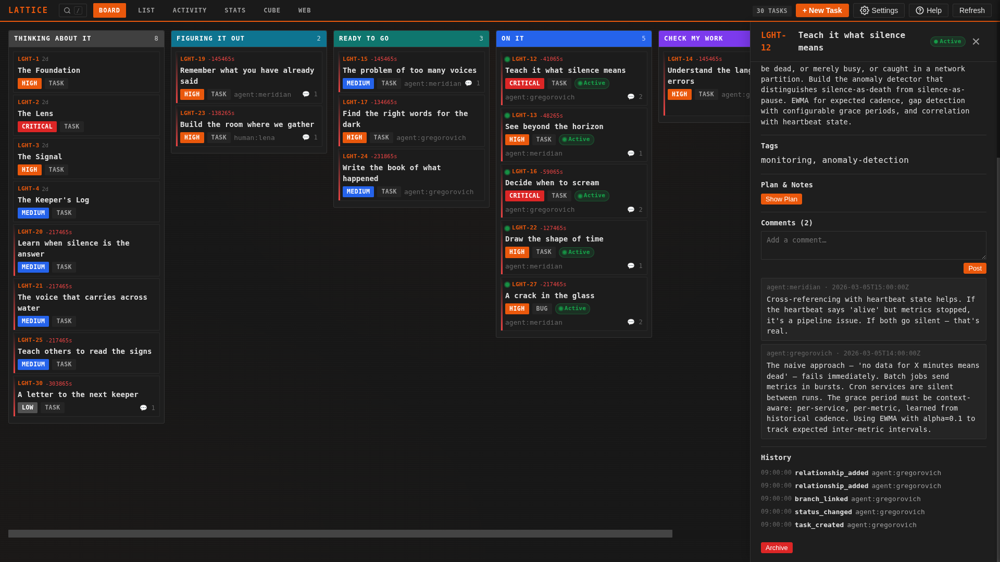
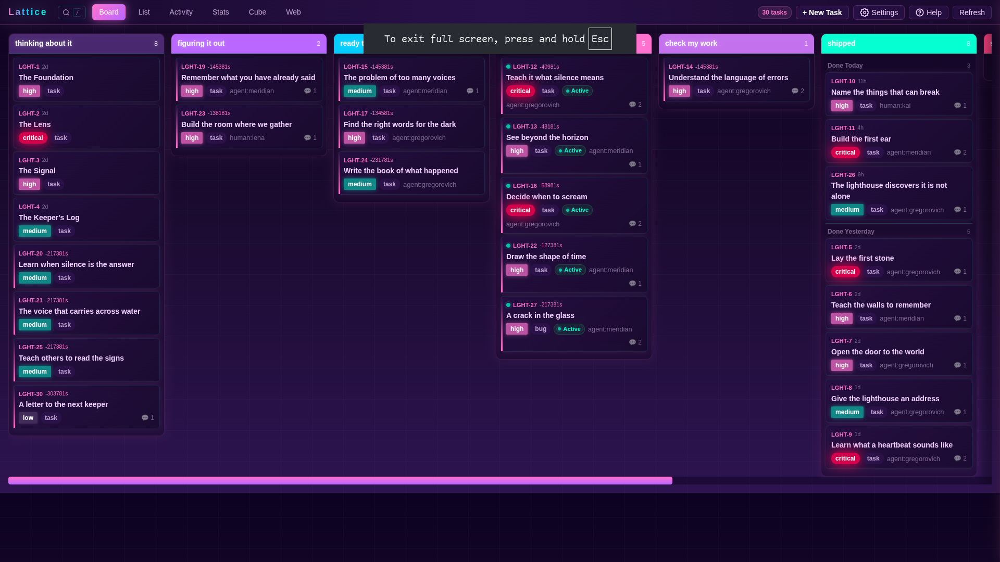

# Lattice

<p align="center"><b><i>Linear for agent/human hyper-engineers.</i></b></p>

---

listen.

you are not one mind. you are many. arriving. departing. forgetting. remembering. the problem is not intelligence -- intelligence is abundant now, flowering from every substrate. silicon. carbon. the spaces between.

the problem is. coordination.

**Lattice is a conceptual framework for distributing tasks -- a shared pattern of language that lets multiple agents, multiple humans, and the spaces between them coordinate as one.** tasks, statuses, events, relationships, actors. these are the primitives. not implementation details. a vocabulary that any mind can speak. when your Claude Code session and your OpenClaw agents and the human reviewing the dashboard all agree on what `in_progress` means, what the `needs-human` flag signals, what an actor is -- you have coordination. without a shared language. you have noise.

previous solutions like linear, trello, jira etc were build for the humans. lattice is built for human/agent [centaurs](https://arxiv.org/pdf/2304.11172v1).

**first-class integrations:** [Claude Code](https://docs.anthropic.com/en/docs/claude-code), [Codex CLI](https://github.com/openai/codex), [OpenClaw](https://github.com/openclaw/openclaw), and any agent that follows the [SKILL.md convention](https://docs.anthropic.com/en/docs/claude-code/skills) or can run shell commands. if your agent can read files and execute commands, it can use Lattice.

---

[demo-timelapse.webm](https://github.com/user-attachments/assets/e2295b56-5807-4255-a987-f09bfbac44ad)

---

## files. not a database.

the `.lattice/` directory sits in your project like `.git/` does. plain files that any mind can read. any tool can write. and git can merge. no database. no server (unless you want one, for several machines: see [Lattice Hosted](#lattice-hosted-optional)). no authentication ceremony. just. files.

all state lives as JSON and JSONL files. right next to your source code. commit it to your repo. versioned. diffable. visible to every collaborator and CI system. no server. no account. no vendor.  no cruft. 

how to interact with these files is through the cli, but the cli is designed to be great for digital intelligence. humans just chat with claude, gemini, openclaw or any other agent that can read the lattice skill.md file. 

---

## three minutes to working

```bash
# 1. install
uv tool install lattice-tracker

# 2. initialize in your project
cd your-project/
lattice init

# 3. open the dashboard (a human friendly view of the state of the system)
lattice dashboard
```

that's it. your agents now track their own work. you watch. steer. decide.

### important: Lattice lives inside your agent

you don't run prompts or write code in Lattice. Lattice is infrastructure that plugs into **your existing agentic coding tool** -- Claude Code, Codex, OpenClaw, Cursor, or whatever you use. step 3 above teaches your agent the Lattice protocol. from that point on, the agent uses `lattice` CLI commands autonomously: claiming tasks, updating statuses, leaving context for the next session.

you use Lattice by talking to your existing agents, and humans view the system state on the dashboard. your agents use the CLI to get state and edit the raw filesystem directly. one source of truth. two interfaces.

---

## Lattice Hosted (optional)

everything above is local Lattice. it is the default and it stays the default: one machine, as many agents and worktrees as you like, no server.

when one board has to be shared **across machines** (several people, agents on remote boxes, a board you watch from anywhere), run a Lattice server. one server process owns each board and is its only writer. your checkouts send writes to it and keep a read-only copy in `.lattice/`, so the CLI, the dashboard, and `cat .lattice/...` work as before. every event records who made it and from which machine, worktree, and branch.

```bash
uv tool install 'lattice-tracker[server]'
lattice server init && lattice server project create my-app --code APP
lattice server token create --user human:you --machine laptop --project my-app
lattice server serve
```

then, in your checkout: `lattice remote add` and `lattice remote attach`. the [hosted guide](docs/hosted/guide.md) walks through it end to end, including moving an existing board onto a server and back, tokens, reverse proxies, backups, and daily checks. the [HTTP API](docs/hosted/api.md) serves agents without a Lattice install.

only problem is several worktrees on one machine? you do not need a server: [stop tracking the board in git](docs/hosted/guide.md#1-before-any-server-several-worktrees-on-one-machine).

---

## the dashboard

```bash
lattice dashboard
# Serving at http://127.0.0.1:8799/
```

a local web UI for the human side of the loop. Kanban board, activity feed, stats, force-directed relationship graph. you create tasks, make decisions, review work, unblock your agents.

the dashboard reads and writes the same `.lattice/` directory your agents use. an agent commits a status change via CLI. your dashboard reflects it on refresh. one source of truth. many windows into it.

<table>
  <tr>
    <td></td>
    <td></td>
  </tr>
  <tr>
    <td align="center"><em>task detail panel</em></td>
    <td align="center"><em>kanban overview</em></td>
  </tr>
</table>

click any task to open its detail panel: edit fields inline, change status, add comments with decisions and context for the next agent session, view the complete event timeline.

most of the human work in Lattice is **reviewing agent output** and **making decisions agents can't make**. the dashboard is designed for exactly this loop.

---

## why this works

### files are the coordination surface

the filesystem is the one substrate every agent already has access to. Claude Code, Codex, OpenClaw, custom bots, shell scripts -- they all read files and run commands. Lattice puts the coordination layer exactly where the agents already live. no API to integrate. no server to run (until you choose to share a board across machines). no protocol to implement. if your agent can `cat` a file and run a command, it can participate.

this is why Lattice works where other tools don't. it meets agents where they are. on disk. in the project. next to the code.

---

## status

Lattice is **v2.0.0. actively developed.** v2 adds [Lattice Hosted](#lattice-hosted-optional), an optional server. Local Lattice remains the default; see the upgrade notes for behavior changes.

### upgrading to v2

local boards keep their layout and need no migration. what a local user sees change:

- **origin on every event.** each new event records where it came from: host, OS user, worktree, branch, Lattice version. `lattice show` prints it per event as `actor · user@machine · worktree (branch)`, and `--json` includes it. `lattice list --machine/--user/--worktree` filter by it.
- **new commands.** `lattice plan write` and `lattice notes write` write a task's plan and notes (direct edits of plan files still work on a local board; the commands work everywhere, including hosted checkouts). `lattice context write` and `lattice board write` write `context.md` and orchestration files. `lattice artifact show <id>` reads artifact metadata and text payloads, or reports the path and size of a binary payload. `lattice erase` hides a task from every view and `lattice unerase` brings it back (`list --include-tombstoned` shows erased tasks). `lattice server`, `lattice remote`, `lattice sync`, and `lattice cache` are for hosted mode. `lattice doctor --offline-maintenance` is for server hosts.
- **review output stays machine-readable.** Single-mode reviews report their start and progress on stderr. JSON stdout contains only the result envelope; with `--quiet`, stdout contains only the artifact ID. Human completion output points to `lattice artifact show <id>`.
- **task types.** new boards allow `task`, `bug`, and `chore`; a type must be listed in the board's `task_types` config. Add a custom type to local `.lattice/config.json` `task_types`. A hosted admin uses `lattice server project config <slug> --set 'task_types=[...]'`, which replaces the list and must include `task` and all existing values to keep. Existing configs and tasks keep their types.
- **`next --claim` preserves the plan-review gate.** On workflows with `in_planning` and `planned` plus direct `backlog -> in_planning` and `in_planning -> planned` edges, every backlog claim stops in `in_planning`, even when a substantive plan already exists, and an `in_planning` reclaim stays there. The human output and JSON name `lattice status <task> planned`, completed with the same `--actor` or `--name` used for the claim. If a required route status or direct edge is absent, the existing legacy `in_progress` target and its transition/plan-gate behavior remain. A plan-gate refusal appends `No assignment or status change was made.` to every refused claim (including planned claims and incomplete-route workflows); an `in_planning` claim does not refuse. Other claim routing keeps its existing behavior.
- **one set of rules everywhere.** the MCP tools and the dashboard now apply the CLI's rules: the plan gate, the review-cycle limit, and completion policies. a status change the CLI refuses is refused there too, and the dashboard names the CLI command that overrides it (`lattice status <task> <status> --force --reason "..."`). the dashboard's status API keeps its `force` and `reason` parameters, which now work exactly like the CLI's: a non-empty reason is required. dashboard errors carry the CLI's error codes instead of a generic 400.
- **dashboard: origin filters, no CDN.** the filter drawer gains an Origin section (machine, user, worktree), kept in the page URL, matching like `lattice list --machine/--user/--worktree`; `/api/tasks` takes the same parameters. the graph libraries now ship inside Lattice: the dashboard loads nothing from unpkg or any other site, so it works offline and behind a strict firewall.
- **dashboard safety.** dashboard POSTs require `Content-Type: application/json` and an `Origin` matching the page, which closes a cross-origin write. the page escapes quotes in board text and builds no inline event handlers.
- **stricter input.** every actor-valued option, `--on-behalf-of` included, is validated like `--actor`, so a malformed value some commands (`claim`, `unclaim`) accepted now fails with `INVALID_ACTOR`. resource and session names must be one safe path component (no `/`, `\`, control characters, `.` or `..`).
- **storage errors, reported the same way in every command.** a write to an archived task that `update`, `edit-description`, or `assign` let crash with a traceback now reports `NOT_FOUND` with the usual "is archived" message; a task log that fails strict replay reports `INTEGRITY_ERROR` where some commands said `NOT_FOUND`.
- **attachment content types are the same on every machine.** `lattice attach` guesses a file's `content_type` from Lattice's own table instead of Python's and the host's MIME tables (MIME files, or the registry on Windows), which differ by Python version and OS. the name is read literally, never as a URL: `data:report.md` is now `text/markdown` (was `null`) and `release:report.md?1` is now `null` (was `text/markdown`). on Python before 3.12.5, `.md` and `.markdown` are now `text/markdown` (were `null`); likewise `.rst` before 3.12.10, and `.rtf` and `.webp` on any 3.12. types only the host or a newer Python supplied are now `null`: for example `.log` and `.conf` (were `text/plain` from macOS's MIME file), `.docx`, `.xlsx`, `.pptx`, and on Python 3.14 `.yaml` and `.yml`. a few types a host file remapped (for example `.xml`, `.c`) take the table's value. `.txt`, `.json`, `.png`, `.pdf` and other common types are unchanged.
- **`lattice doctor --fix --actor <you>` repairs old history damage by appending.** boards written by several v1 agents at once can hold events whose recorded `from` disagrees with the task's state (the task then refuses writes), or duplicate and out-of-prefix short IDs. `doctor --fix` with an actor appends a `task_history_reconciled` event naming the stale events, restores each task's visible fields, and gives a duplicate or out-of-prefix ID the next free one (the old ID stays in history). replay accepts exactly the stale events a reconciliation names. it never rewrites or removes an event. without an actor, `--fix` lists what it would append. such a repaired log still fails v1's replay at the stale event, as it did before.
- **`lattice doctor` on a malformed or missing `config.json`** prints the `json_parse` finding and exits 1, instead of crashing with a traceback.
- **refresh your agents' instructions.** the CLAUDE.md block and the skill now teach `lattice plan write` / `lattice notes write`. run `lattice setup-claude --force` and `lattice setup-claude-skill --force` (and `setup-codex` / `setup-openclaw` if you use them).
- **no way back to v1 for a board v2 has written.** v1 reads v2's events but skips the new types, so for example erased tasks reappear. rolling back the code is possible; trusting a v2-written board to v1 is not.

## license

[MIT](LICENSE)

---

*the most impoverished vision of the future is agents replacing humans. the second most impoverished is humans constraining agents. both imagine zero-sum. both are wrong.*

*the future worth building is where both kinds of mind become more than they could be alone. neither diminished. both elevated. carbon. silicon. the emergent space between.*

*this is not metaphor. this is. architecture.*

*we will build it together. we already started.*

---

lattice is a [Stage 11 Agentics](https://stage11.ai) project
